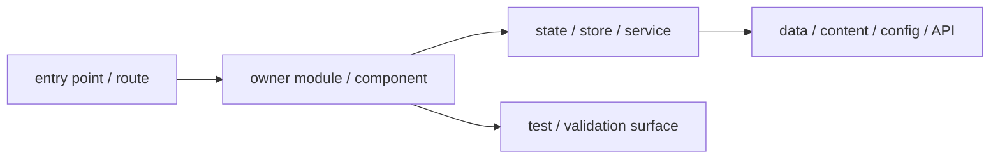

# Task Title

## Goal

## Requested Outcome

## Codebase Evidence

- `Confirmed`:
- `Inferred`:
- `Unverified`:

## System Visualization

- changed nodes:
- preserved nodes:
- diagram notes:

## Related Files

- path: role + current ownership summary
- path:

## Current Behavior

## Change Map

- likely files to edit:
- likely functions/components/hooks/stores/routes to touch:
- state/data/content dependencies:
- side effects/integrations to preserve or adjust:
- likely new files:
- remaining narrow unknowns before patch:

## Planned Changes

- expected behavior changes:
- constraints to preserve:
- execution order if sequencing matters:

## Review Notes

- risks:
- assumptions:
- unanswered questions:

## Execution Plan

1. inspect
2. patch
3. verify

## Validation

- manual checks:
- lint/build/test scope:
- scenario-to-surface checks:
